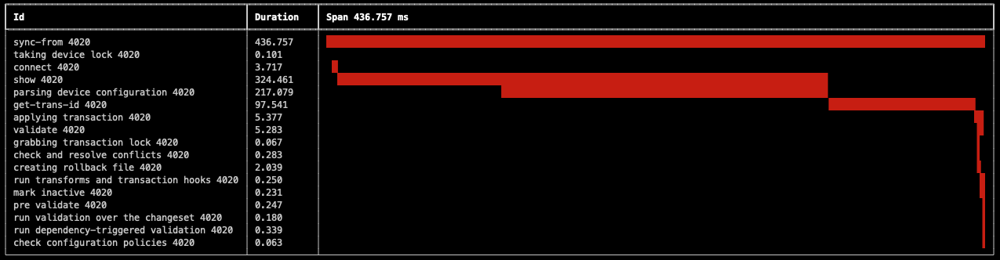

# Progress Trace Viewer

## Overview

This repository contains a number of very simplistic tools to analyze the
content of a progress trace csv file.

Works with NSO 5.x and 6.0.
Not tested with NSO 6.1.

## Dependencies

The scripts in this repository have dependencies to e.g. rich and pandas.
You can use the file 'requirements.txt' to install them.

```
pip3 install -r requirements.txt
```

## Tools

### ncs_progress_trace_viewer

The viewer reads a progress trace and uses the Python module 'rich' to visualize
the spans.

```
❯ ./ncs_progress_trace_viewer.py -h
usage: ncs_progress_trace_viewer.py [-h] [-f] [-o] [--setup] [file]

positional arguments:
  file          File to process.

optional arguments:
  -h, --help       show this help message and exit
  -f, --follow     Follow file and graph as traces come.
  -o               Graph operational transactions.
  --setup          Config progress trace in NSO.
  --filter FILTER  Read events to filter from file.
  --tid TID        Filter on transaction id.
  --write WRITE    Write the progress trace events to file.
  --interactive    Skip view updates and sleeps during parsing.
```



### list_tids

List transactions id:s in progress trace file.

```
❯ ./list_tids.py -h
usage: list_tids.py [-h] [--event EVENT] [-b BEGIN] [-e END] file

positional arguments:
  file                  File to process.

optional arguments:
  -h, --help            show this help message and exit
  --event EVENT         File to process.
  -b BEGIN, --begin BEGIN
                        Start timestamp
  -e END, --end END     End timestamp
```

```
❯ ./list_tids.py testdata/nso5.8-devices-sync-from-677-bad.csv
1525  sync-from       8709 error
1557  sync-from       8666 error
1563  sync-from       8721 error
1603  sync-from       8665 error
1604  sync-from       8676 error
1605  sync-from       8667 error
1606  sync-from       8698 error
1609  sync-from       8727 error
1610  sync-from       8674 error
1611  sync-from       8718 error
1612  sync-from       8675 error
1613  sync-from       8668 error
1614  sync-from       8703 error
1615  sync-from       8684 error
1618  sync-from       8702 error
1663  sync-from       8688 error
1668  sync-from       8677 error
1776  sync-from       8671 error
1786  sync-from       8707 error
1810  sync-from       8664 error
1816  sync-from       8725 error
1819  sync-from       8670 error
....
```

### list_events

List event types in progress trace.

```
❯ ./list_events.py -h
usage: list_events.py [-h] [-n] file

positional arguments:
  file          File to process.

optional arguments:
  -h, --help    show this help message and exit
  -n, --negate  Negate/comment events.
```

```
❯ ./list_events.py testdata/nso5.8-devices-sync-from-677-bad-sequential.csv
applying transaction
check and resolve conflicts
check configuration policies
connect
connecting
creating rollback file
extended parsing
grabbing transaction lock
mark inactive
populating cdb
pre validate
reading config
run dependency-triggered validation
run transforms and transaction hooks
run validation over the changeset
show
sync-from
taking device lock
transforming input
validate
```

### calc_events_stats

Calculate statistical analysis of a progress trace.

```
❯ ./calc_events_stats.py -h
usage: calc_events_stats.py [-h] file

positional arguments:
  file        File to process.

optional arguments:
  -h, --help  show this help message and exit
```

```
❯ ./calc_events_stats.py testdata/nso5.8-devices-sync-from-692.csv
=== RUNNING ===
                                      COUNT          SUM       STD       MEAN       MIN        MAX
MESSAGE
applying transaction                    100    13.465782  0.111932   0.134658  0.034593   0.602140
check and resolve conflicts             100     0.086746  0.000453   0.000867  0.000331   0.002959
check configuration policies            100     0.027511  0.000399   0.000275  0.000057   0.002492
check data kickers                      100     0.031102  0.000693   0.000311  0.000059   0.006172
commit                                  100     6.674878  0.049812   0.066749  0.015458   0.320697
connect                                 100   574.442852  1.797633   5.744429  1.833915   7.714742
connecting                              100    48.683532  0.325987   0.486835  0.089268   1.057545
create pre commit running               100     0.054250  0.001030   0.000543  0.000179   0.009615
creating rollback file                  100     1.054146  0.014756   0.010541  0.002065   0.077616
extended parsing                        100   222.014208  1.066997   2.220142  0.559862   4.131208
grabbing transaction lock               100     0.088941  0.002920   0.000889  0.000065   0.017816
mark inactive                           100     0.138837  0.001646   0.001388  0.000517   0.013282
match subscribers                       100     0.016582  0.000146   0.000166  0.000067   0.000934
populating cdb                          100   433.500717  1.839304   4.335007  0.696997   6.436592
pre validate                            100     0.102511  0.001782   0.001025  0.000426   0.017500
prepare                                 100     2.954114  0.023107   0.029541  0.005728   0.169986
reading config                          100   110.568906  0.743638   1.105689  0.142738   2.443519
run dependency-triggered validation     100     0.079764  0.000514   0.000798  0.000377   0.003221
run transforms and transaction hooks    100     0.527048  0.002351   0.005270  0.002783   0.017958
run validation over the changeset       100     0.194883  0.003436   0.001949  0.000621   0.030762
show                                    100   860.445585  3.213664   8.604456  1.845719  11.898066
switch to new running                   100     1.589918  0.006279   0.015899  0.004162   0.035622
sync-from                               100  1895.030407  5.240339  18.950304  8.973195  25.725557
taking device lock                      100     0.068161  0.002177   0.000682  0.000081   0.021865
transforming input                      100     2.520959  0.050396   0.025210  0.004167   0.459761
validate                                100     3.092014  0.035893   0.030920  0.009112   0.200453
write changeset                         100     0.048175  0.001072   0.000482  0.000155   0.010665
write-start                             100     0.628089  0.010098   0.006281  0.001471   0.061771

=== NO DATASTORE ===
Empty DataFrame
Columns: [COUNT, SUM, STD, MEAN, MIN, MAX]
Index: []

=== OPERATIONAL ===
                      COUNT        SUM       STD      MEAN       MIN       MAX
MESSAGE
applying transaction    300  12.170204  0.057201  0.040567  0.000359  0.347146
check data kickers      100   0.120298  0.001045  0.001203  0.000086  0.004970
commit                  200   6.916492  0.031108  0.034582  0.004420  0.206134
prepare                 200   0.335749  0.003671  0.001679  0.000135  0.029885
write-start             200   4.326230  0.034152  0.021631  0.000748  0.185219
```

### list_events_duration

List events duration in descending order (duration, device name, tid).

```
❯ ./list_events_duration.py -h
usage: list_events_duration.py [-h] [--event EVENT] [-b BEGIN] [-e END] file

positional arguments:
  file                  File to process.

optional arguments:
  -h, --help            show this help message and exit
  --event EVENT         File to process.
  -b BEGIN, --begin BEGIN
                        Start timestamp
  -e END, --end END     End timestamp
```

```
❯ ./list_events_duration.py testdata/nso5.8-devices-sync-from-677.csv
2023-05-02 19:43:23.166278  sync-from       175.2  ios39                     41297 nan
2023-05-02 19:43:23.099672  sync-from       175.1  ios25                     41323 nan
2023-05-02 19:43:23.016859  sync-from       175.0  ios5                      41299 nan
2023-05-02 19:43:22.938669  sync-from       175.0  ios7                      41322 nan
2023-05-02 19:43:22.843204  sync-from       174.9  ios23                     41320 nan
2023-05-02 19:43:22.742772  sync-from       174.8  ios79                     41355 nan
2023-05-02 19:43:22.601871  sync-from       174.6  ios69                     41309 nan
2023-05-02 19:43:22.437716  sync-from       174.5  ios46                     41351 nan
2023-05-02 19:43:22.169591  sync-from       174.2  ios48                     41360 nan
2023-05-02 19:43:21.773865  sync-from       173.8  ios27                     41326 nan
2023-05-02 19:43:21.473858  sync-from       173.5  ios17                     41332 nan
2023-05-02 19:43:21.195851  sync-from       173.2  ios73                     41313 nan
2023-05-02 19:43:20.870704  sync-from       172.9  ios34                     41349 nan
...
```

### show_overlap

Show how many given events concurrently happen at a time.

```
❯ ./show_overlap.py -h
usage: show_overlap.py [-h] [--show-spans] [--find-spans] [--hide-rows] file event

positional arguments:
  file          File to process.
  event         File to process.

optional arguments:
  -h, --help    show this help message and exit
  --show-spans  Show spans when there is an overlap
  --find-spans  Find overlapping spans
  --hide-rows   Hide rows
```

```
❯ ./show_overlap.py testdata/nso5.8-devices-sync-from-677-bad-sequential.csv sync-from
2023-04-24 23:14:12.321962  1
2023-04-24 23:14:13.399335  0
2023-04-24 23:14:13.405442  1
2023-04-24 23:14:14.458980  0
2023-04-24 23:14:14.466111  1
2023-04-24 23:14:15.528255  0
2023-04-24 23:14:15.533636  1
2023-04-24 23:14:16.620525  0
2023-04-24 23:14:16.626320  1
2023-04-24 23:14:17.697987  0
2023-04-24 23:14:17.705647  1
2023-04-24 23:14:18.780514  0
2023-04-24 23:14:18.786886  1
...
```

### summarize_events

Make a summary analysis of a progress trace.

```
❯ ./summarize_events.py -h
usage: summarize_events.py [-h] [--event EVENT] [-5] [--old] file

positional arguments:
  file           File to process.

optional arguments:
  -h, --help     show this help message and exit
  --event EVENT  File to process.
  -5             Handle as NSO 5.x compatible progress trace.
  --old          Use event 'apply transaction' as lock event.
```

```
❯ ./summarize_events.py -5 testdata/nso5.8-devices-sync-from-bad.csv
===== testdata/nso5.8-devices-sync-from-bad.csv =====

Number of actions:              100
Total time:                     138.5 s
Total number of locks:          20
Total time inside locks:        2.2 s
Percent spent within lock:      2 %

Time to first lock:             135.822929 s

Total time between locks:       0.469249 s
Mean time between locks:        0.024697 s
Stddev time between locks:      0.064
Min time between locks:         0.005433 s
Max time between locks:         0.288114 s
```

## Test data

Progress trace test data from various devices sync-from actions using two
different versions of the cisco-ios-cli NED resides in the testdata directory.

677 indicates that the version 6.77 of the cisco-ios-cli NED was used and
692 indicates 6.92.

The 6.77 version of the NED contains a bug that is triggered by a specific
combination of configuration in the device.
The bug is fixed in version 6.88 and newer of the NED.

| File name | Description |
|-----------|-------------|
| nso5.8-devices-sync-from-677-good.csv | A full devices sync-from of 100 devices, containing no configuration triggering the bug. |
| nso5.8-devices-sync-from-677-bad.csv | A full devices sync-from of 100 devices, containing the configuration triggering the bug. This will cause sync-from towards some devices to timeout. |
| nso5.8-devices-sync-from-677-bad-longer-timeout.csv | A full devices sync-from of 100 devices, containing the configuration triggering the bug. The read-timeout have been increased to mitigate the timeouts. |
| nso5.8-devices-sync-from-677-bad-sequential.csv | A "full" devices device * sync-from of 100 devices, containing the configuration triggering the bug. The sequential execution will not trigger the bug. |
| nso5.8-devices-sync-from-677-one-device.csv | Sync-from of one device will not trigger the bug. |
| nso5.8-devices-sync-from-677.csv | A full devices sync-from of 100 devices, containing the configuration triggering the bug. |
| nso5.8-devices-sync-from-692-one-device.csv | Sync-from of one device with a newer version of the NED will not triggr the bug. |
| nso5.8-devices-sync-from-692.csv | A full devices sync-from of 100 devices with a new version of the NED will not trigger the bug. |
