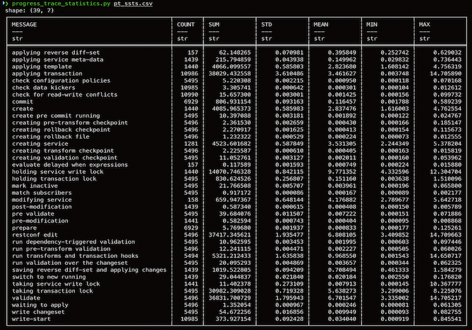
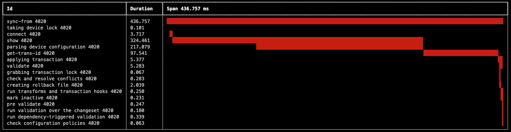

# Progress Trace Viewer

## Overview

This repository contains a collection of lightweight command-line tools for
viewing and analyzing Cisco NSO progress trace CSV files.

The tools support NSO 6 progress traces. Some tools also work with earlier
formats; `ncs_progress_trace_viewer.py --detect` reports the detected format
and capabilities of a trace file.

## Installation

The tools require Python 3.10 or later and the packages listed in
`requirements.txt`. Install the dependencies with:

```console
pip3 install -r requirements.txt
```

## Export a progress trace from NSO

The following configuration is a useful starting point for exporting a
progress trace in CSV format:

```xml
<config xmlns="http://tail-f.com/ns/config/1.0">
  <progress xmlns="http://tail-f.com/ns/progress">
    <trace>
      <name>progress-trace</name>
      <destination>
        <file>progress-trace.csv</file>
        <format>csv</format>
      </destination>
      <enabled>true</enabled>
      <verbosity>very-verbose</verbosity>
    </trace>
  </progress>
</config>
```

Save the configuration as `progress-trace.xml` and load it into NSO with
`ncs_load`:

```console
ncs_load -lm progress-trace.xml
```

Alternatively, configure the trace from the NSO CLI:

```text
configure
unhide debug
progress trace progress-trace
destination file progress-trace.csv
format csv
enabled true
verbosity very-verbose
```

## Command-line tools

All tools can be run directly from the repository. Use `--help` with any
command to display its current command-line options.

### `progress_trace_statistics.py`

Calculates count, sum, standard deviation, mean, minimum, and maximum duration
statistics for completed events (the trace contains both a start and a stop event).

This tool is useful for analyzing the performance of NSO operations by providing
statistical insights into the duration of various operations and a good start to find possible bottle necks, before looking into individual transactions.

```console
./progress_trace_statistics.py [options] file
```

| Option | Description |
| --- | --- |
| `-h`, `--help` | Show help and exit. |
| `--msg MSG` | Include one or more comma-separated messages. |
| `--msg-filter MSG_FILTER` | Include messages listed in a file, one message per line. Blank lines and lines beginning with `#` are ignored. |
| `-f FILTER`, `--filter FILTER` | Apply a filter expression. Use underscores for spaces in column names. |
| `-s SORT`, `--sort SORT` | Sort by one or more comma-separated result columns. |
| `-a`, `--annotation` | Group by annotation as well as message. |

Example:

```console
./progress_trace_statistics.py --sort MAX testdata/progress-trace-1.csv
```



### `ncs_progress_trace_viewer.py`

Displays progress trace spans as a terminal graph using Rich.

```console
./ncs_progress_trace_viewer.py [options] [file]
```

| Option | Description |
| --- | --- |
| `-h`, `--help` | Show help and exit. |
| `-f`, `--follow` | Follow the file and update the graph as trace events arrive. |
| `--oper` | Include operational transactions. |
| `--bw` | Render the graph in black and white. |
| `--color-trid` | Assign colors by trace ID instead of transaction ID. |
| `--show-span-ids` | Show span ID and parent span ID columns. |
| `--msg-filter FILE` | Include messages listed in `FILE`, one message per line. Blank lines and lines beginning with `#` are ignored. |
| `--version` | Show the program version and exit. |
| `--detect` | Report the detected NSO progress trace format and capabilities, then exit. |

Example:

```console
./ncs_progress_trace_viewer.py testdata/progress-trace-1.csv
```



### `progress_trace_filter.py`

Filters, groups, and selects data from a progress trace. Comma-separated filter
values are supported. Prefix a value with `^` to exclude it, or use `~` to
match a null value.

```console
./progress_trace_filter.py [options] file
```

| Option | Description |
| --- | --- |
| `-h`, `--help` | Show help and exit. |
| `--tid TID` | Filter by transaction ID. |
| `--trid TRID` | Filter by trace ID. |
| `--et ET` | Filter by event type. |
| `--msg MSG` | Filter by message. |
| `--ctx CTX` | Filter by context. |
| `--ds DS` | Filter by datastore. |
| `--device DEVICE` | Filter by device. |
| `--node NODE` | Filter by node. |
| `--service SERVICE` | Filter by service. |
| `--ann ANN` | Filter by annotation. |
| `--dur DUR` | Filter by duration. This option is currently non-functional. |
| `--begin BEGIN` | Include events at or after this ISO-format timestamp. |
| `--end END` | Include events at or before this ISO-format timestamp. |
| `-f FILTER`, `--filter FILTER` | Apply a filter expression. Use underscores for spaces in column names. |
| `-m`, `--mincols` | Display a reduced set of columns. |
| `-n`, `--nodyncols` | Remove dynamic columns, which is useful when comparing runs. |
| `-o OUTPUT`, `--output OUTPUT` | Write the result to a CSV file instead of displaying it. |
| `-s`, `--start` | Calculate each start timestamp from its end timestamp and duration. |
| `--rows ROWS` | Set the number of displayed rows. The default is `50`. |
| `-v`, `--verbose` | Display the Polars query plan before the result. |
| `--group GROUP` | Group by one or more comma-separated columns. |
| `+c ADDCOLS` | Add output columns. Repeat the option or provide comma-separated names. |

Because this command supports `+c`, options may begin with either `-` or `+`.

Examples:

```console
./progress_trace_filter.py --msg sync-from testdata/progress-trace-1.csv
./progress_trace_filter.py --ds running --group MESSAGE testdata/progress-trace-1.csv
```

### `polars_list_longest_spans.py`

Lists the longest and second-longest spans for each trace ID and reports the
overlap count. The input must contain `SPAN ID` and `PARENT SPAN ID` columns.

```console
./polars_list_longest_spans.py [options] file
```

| Option | Description |
| --- | --- |
| `-h`, `--help` | Show help and exit. |
| `-e EVENT`, `--event EVENT` | Limit the longest-span selection to this message. |
| `--show-spans` | Accepted for compatibility; currently has no effect. |
| `--find-spans` | Accepted for compatibility; currently has no effect. |
| `--hide-rows` | Accepted for compatibility; currently has no effect. |

Example:

```console
./polars_list_longest_spans.py --event sync-from progress-trace-1.csv
```

### `polars_show_overlap.py`

Shows overlap information for completed spans in the running datastore. By
default, it processes root spans and `restconf edit` spans. Root-span analysis
requires a `PARENT SPAN ID` column.

```console
./polars_show_overlap.py [options] file
```

| Option | Description |
| --- | --- |
| `-h`, `--help` | Show help and exit. |
| `--event EVENT` | Process only spans with this message. |
| `--show-spans` | Show the other open spans when an overlap occurs. |
| `--show-tid` | Accepted by the command; currently has no effect. |
| `--find-spans` | Show overlapping spans without displaying the standard rows. |
| `--hide-rows` | Hide the standard output rows. |
| `--debug` | Show start-event and overlap debugging information. |

Example:

```console
./polars_show_overlap.py --event sync-from testdata(progress-trace-1.csv
```

### `preprocess_progress_trace.py`

Converts progress trace attribute rows into columns. This makes fields such as
`DEVICE`, `SERVICE`, and `TRANSACTION_PHASE` easier to process with the other
tools.

It also sorts the trace by timestamp to ensure correct processing, as it is not guaranteed that unrelated spans are logged chronologically. This is useful when working on huge traces where the order of spans is not guaranteed and needs to be sorted for correct analysis. Polars is good at keeping the data in memory efficient way, when sorted.

```console
./preprocess_progress_trace.py [-h] input output
```

| Argument or option | Description |
| --- | --- |
| `input` | Progress trace CSV file to process. |
| `output` | Destination CSV file. |
| `-h`, `--help` | Show help and exit. |

Example:

```console
./preprocess_progress_trace.py progress-trace-1.csv preprocessed-progress-trace-1.csv
```
